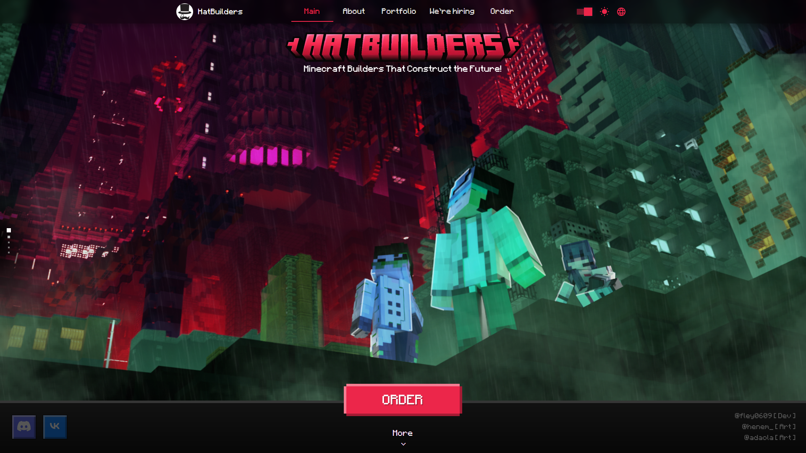
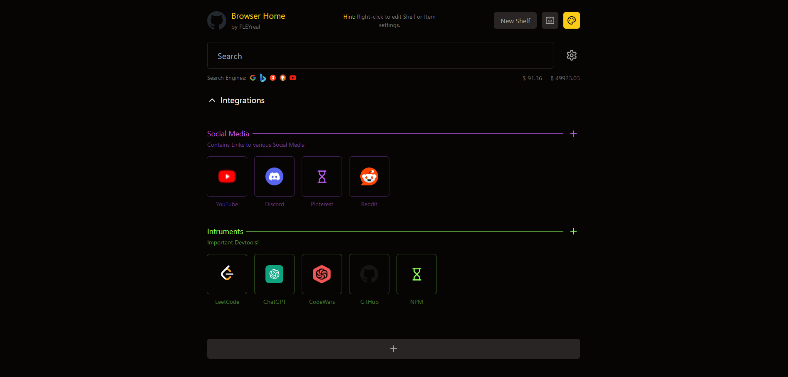
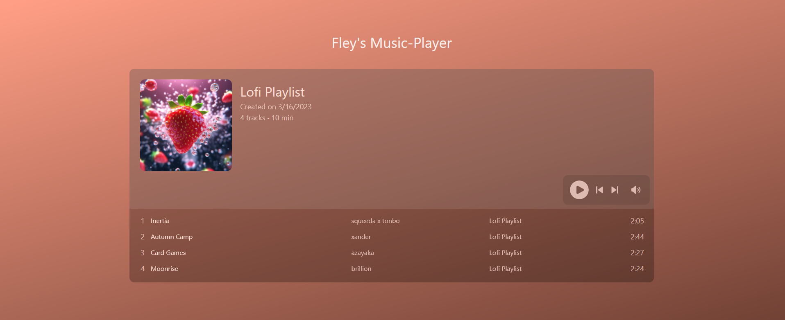

## 🔥 Skills

<b>LANGUAGES:</b>

<b>ALMOST LANGUAGES 🤨:</b>

<b>TECHNOLOGIES:</b>

<b>FRAMEWORKS:</b>

<b>UI-LIBRARIES:</b>

<b>DATABASES:</b>

## 🔥 Portfolio
The list of the project I've done and currently working on!

<button><kbd><kbd>CLICK</kbd> to expand!</kbd></button>

### <a href="https://github.com/FLEYreal/HatBuilders-Website">1. HatBuilders-Website</a>

<blockquote>Website for my Project: HatBuilders. We're creating the best minecraft buildings for other projects, servers and ordinary players. The project is currently under development but the website is completed, check it out: https://hatbuilders.vercel.app/en</blockquote>

### 2. CodeWave

<blockquote>Failed startup CodeWave Hub that provides development services. Its key feature was a combination of Freelance and Dev Studios. Unfortunetely though, the project has been closed a long time ago but version of website is uploaded here: https://codewave-hub.ru</blockquote>

### <a href="https://github.com/FLEYreal/Browser-Home">3. Browser-Home</a>

<blockquote>This is a convenient replacement for basic browser's home page. It's mostly for personal usage but you can also use it if you want to. It will be integrated with my another project: Social AI that will be able to copy my behaviour and answer to message in discord / telegram while I'm idle.</blockquote>

### <a href="https://github.com/FLEYreal/ChatGPT-Assistant">4. ChatGPT-Assistant</a>

<blockquote>ChatGPT-Assisant that can work in as discord bot or in web-interface (inteface if a clone chatGPT's chat). Can be implemented on website with <iframe> tag. Script contains 3 config, for main, style and language configs. Main one contains all settings for the entire project. Project was made on NodeJS & Express.JS</blockquote>

### <a href="https://github.com/FLEYreal/Storm-Shop-Project">5. StormShop-Project</a>

<blockquote>Uncompleted StormShop website. This is a shop that sells Nitro, Netflix and other subscriptions to Russian Users unable to purchase them. Also sells scripts for various needs. Website contains main page, page with scripts, search bar and feature to add articles</blockquote>

### <a href="https://github.com/FLEYreal/Music-Player">6. Music-Player</a>

<blockquote>Music player widget with a lot of features, see show case here: https://music-player-eta-one.vercel.app</blockquote>

### <a href="https://github.com/FLEYreal/Video-Player">7. Video-Player</a>

<blockquote>Convenient video player with a lot of features, see show case here: https://video-player-rust.vercel.app/</blockquote>

### <a href="https://github.com/FLEYreal/Discord-Message-Spammer">8. Discord-Message-Spammer</a>

<blockquote>This is a discord bot, that can send notifications to all users of discord server it's located. Can be used for mailing to everyone. Bot also has filters, message can be sent to exact role. Has API to send notification with. Project was mde with NodeJS & Express.JS & Typescript</blockquote>

### <a href="https://github.com/FLEYreal/SAS-Discord-Bot">9. SAS-Discord-Bot</a>

<blockquote>This is a discord bot, that uses API of steam and cs:go to get information about XP of the steam users, sends custom message to discord as XP updated!</blockquote>

### <a href="https://github.com/FLEYreal/LightShot-Parser">10. LightShot-Parser</a>

<blockquote>Parses LightShot to get random screenshots made by people using lightshot app. Free to use! All docs of usage are in README.md</blockquote>

